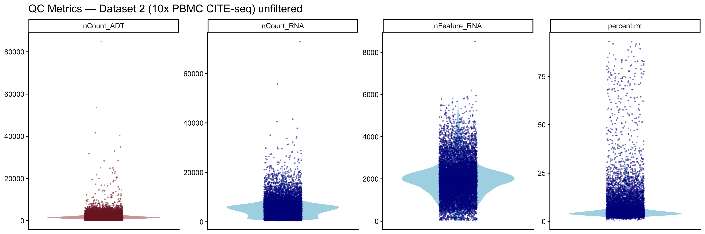
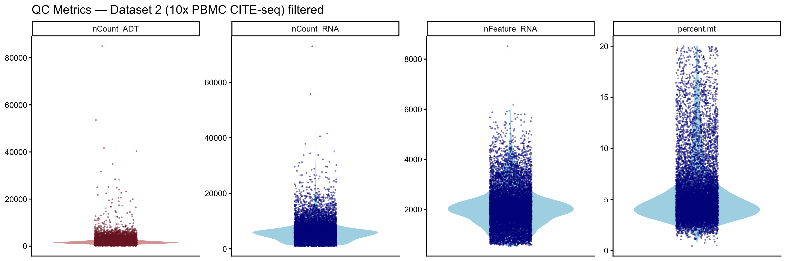
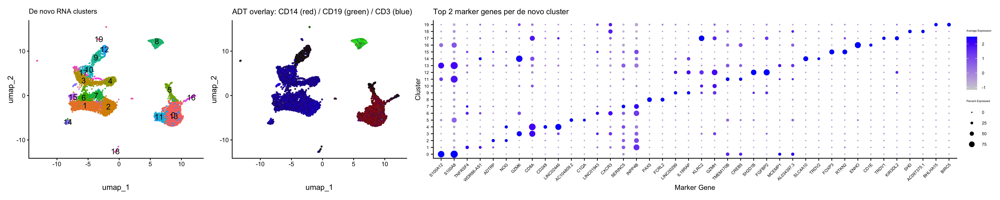
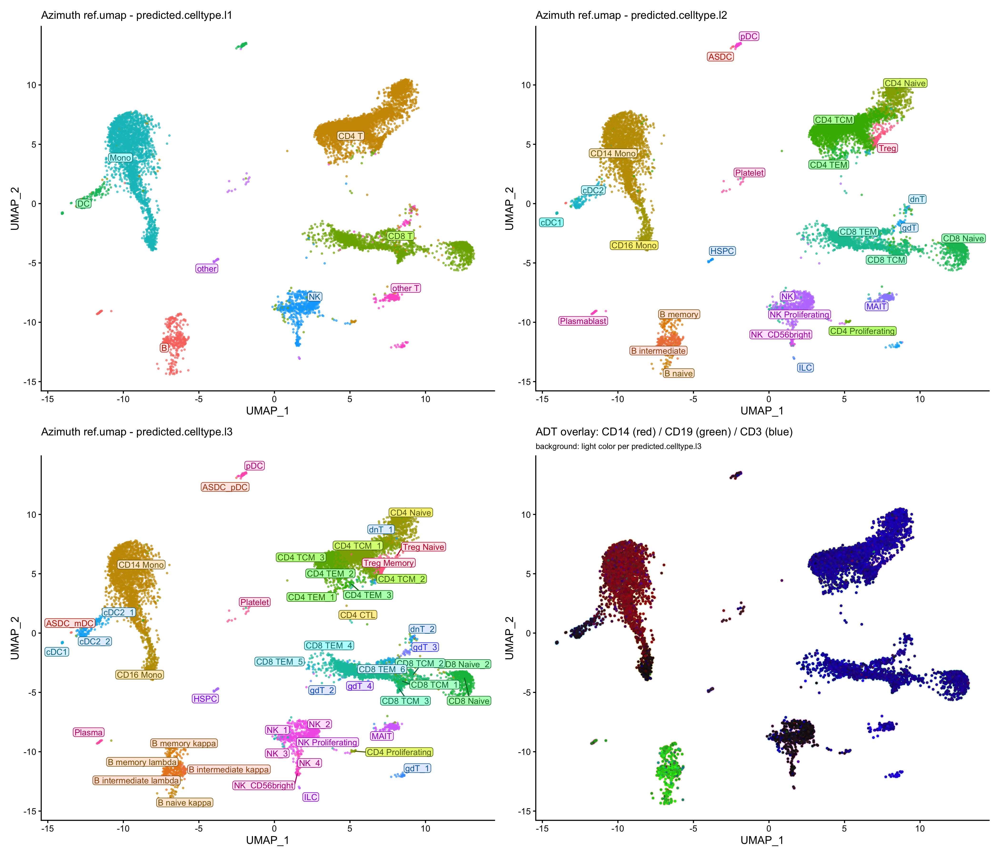
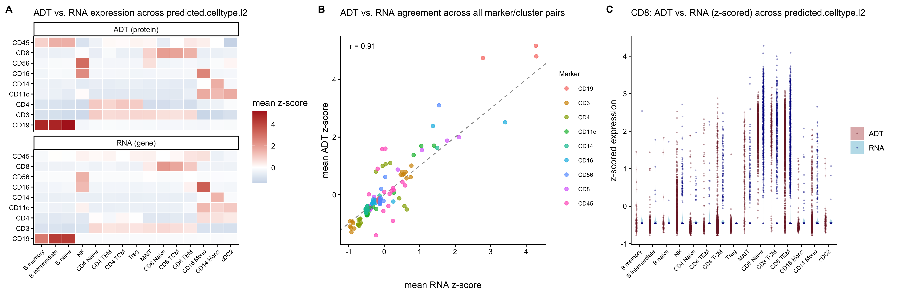
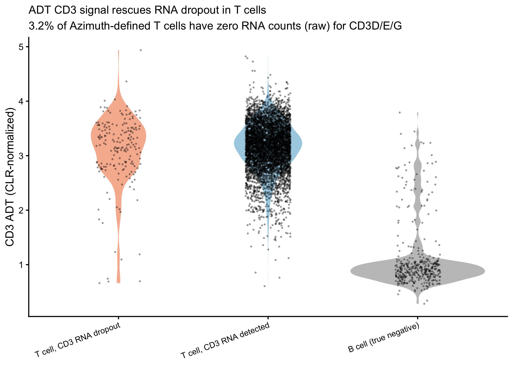
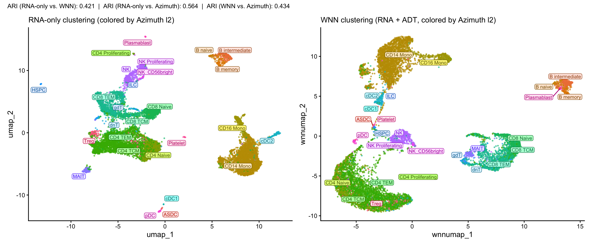

# 1. SETUP

Project local dir:
`/Users/shivanbonanno/science/projects/PBMC-CITE-seq-ADT-azimuth-mapping`

### 1-I. Directory structure (terminal)
```bash
mkdir -p PBMC-CITE-seq-ADT-azimuth-mapping/{data/raw,data/processed,data/reference,R,notebooks,figures,output}
cd PBMC-CITE-seq-ADT-azimuth-mapping
touch README.md .gitignore
touch data/raw/.gitkeep data/reference/.gitkeep data/processed/.gitkeep
```

`.gitignore`:
```
# renv
renv/library/
renv/staging/

# Data (too large for git, download instructions documented instead)
data/raw/*
data/reference/*
data/processed/*
!data/raw/.gitkeep
!data/reference/.gitkeep
!data/processed/.gitkeep

# R
.Rproj.user/
.Rhistory
.RData
.Ruserdata

# OS
.DS_Store
```

### 1-II. R environment setup

Use the native R install (not conda-managed) - better for pkg mgmt:
```bash
which -a R
/usr/local/bin/R --version
# R version 4.6.1 (installed fresh via .pkg from mac.r-project.org;
# originally started on R 4.5.1, upgraded after OpenMP/toolchain issues below)
```

Required system toolchain (install before package installs, avoids
compile errors later):
```bash
# Homebrew (if not already installed)
/bin/bash -c "$(curl -fsSL https://raw.githubusercontent.com/Homebrew/install/HEAD/install.sh)"

# gettext - required for libintl.h, missing from recent Xcode CLT SDKs
brew install gettext

# gfortran - required for Fortran code in several package dependencies
# download gfortran-14.2-universal.pkg from https://mac.r-project.org/tools/
# and run the installer (installs to /opt/gfortran)
```

`~/.R/Makevars` (points compiler at gettext):
```
CPPFLAGS += -I/opt/homebrew/opt/gettext/include
LDFLAGS += -L/opt/homebrew/opt/gettext/lib -lintl
```

Open R studio, confirm it is pointed at this R version: Tools → Global Options →
General → R version
open a new project via .Rproj file.
Rstudio: File -> New Project -> Exiting Directory -> select your proj folder
save as: PBMC-CITE-seq-ADT-azimuth-mapping.Rproj
opening the proj this way auto sets wd to proj dir
Then go to Rstudio console (R) and:
```r
getwd()
install.packages("renv")
renv::init()
```
```r
install.packages(c("BiocManager", "Seurat", "SeuratObject", "patchwork", "dplyr", "ggplot2", "hdf5r", "Matrix"))
```
```r
BiocManager::install(c(
  "ensembldb",
  "EnsDb.Hsapiens.v86",
  "BSgenome.Hsapiens.UCSC.hg38",
  "glmGamPoi",
  "rhdf5",
  "TFBSTools",
  "Signac"
))
```
```r
install.packages("remotes")
remotes::install_github("satijalab/azimuth")
```

**Note:** several packages in this dependency chain (`dotCall64`, `Rtsne`)
initially failed with OpenMP-related dlopen errors (`symbol not found ...
kmpc_...`) under R 4.5.1's CRAN binaries. Root cause: missing `libintl.h`
(gettext) and missing gfortran toolchain for source compilation, compounded
by a broken CRAN binary for `dotCall64` on this system. Resolved by
upgrading to R 4.6.1, installing gettext + gfortran per above, and
reinstalling affected packages from source:
```r
utils::install.packages("dotCall64", type = "source", repos = "https://cran.r-project.org", lib = .libPaths()[1])
utils::install.packages("Rtsne", type = "source", repos = "https://cran.r-project.org", lib = .libPaths()[1])
```

# 2. Selection + download of datasets for this project

#### project goal: demonstrate CITE-seq QC + reference mapping, relevant to platform-validation workflows

### 2-I. choose datasets

**Dataset 1 — Hao et al. 2021 (Satija lab) CITE-seq reference**
- 161,764 PBMCs, 8 donors, 228 ADT panel
- expert-annotated, 3 levels of granularity (WNN-based)
- PBMC cell types stable across datasets → mapping valid
- avoids re-deriving cluster identity de novo
- Azimuth-compatible reference, standard tool for this exact task
- well-cited, heavily vetted annotation quality

**Dataset 2 — 10x Genomics PBMC CITE-seq demo (query)**
- standard demo dataset: 10k PBMCs, healthy donor, TotalSeq-C TBNK panel (BioLegend)
- CC BY 4.0 licensed
- Cell Ranger output, pre-processed matrix (RNA + ADT)
- mimics real platform-validation data: no annotation yet
- goal: QC, cluster, map onto reference above

### 2-II. download data

**Dataset 1 — Hao et al. 2021 PBMC reference (Azimuth)**
No manual download or separate loading step for this.
This CITE-seq PBMC dataset was made by Hao et al, and expert-annotated
(161,764 cells, 8 donors). It is available through Azimuth, so we can map
other datasets to it.

`RunAzimuth(query, reference = "pbmcref")` downloads and caches the reference
automatically on first run, then maps query cells and transfers cell type
labels directly. RunAzimuth is run in notebook 01, not here.

**Dataset 2 — 10x Genomics PBMC CITE-seq demo**
Source page: https://www.10xgenomics.com/datasets/integrated-gex-totalseq-c-and-bcr-analysis-of-chromium-connect-generated-library-from-10k-human-pbmcs-2-standard
File used: Output and supplemental files/Gene Expression - Feature / cell matrix HDF5 (per-sample)
File size: 31.9MB
md5sum: 192eb0a882b8ebe89830d76bcecad45c
date of download: 2026-07-22
```bash
cd /Users/shivanbonanno/science/projects/PBMC-CITE-seq-ADT-azimuth-mapping
curl -L -o data/raw/filtered_feature_bc_matrix.h5 "https://cf.10xgenomics.com/samples/cell-vdj/6.1.2/10k_PBMC_TBNK_connect_10k_PBMC_TBNK_connect/10k_PBMC_TBNK_connect_10k_PBMC_TBNK_connect_count_sample_feature_bc_matrix.h5"
```

# 3. Analysis Pipeline & Figures

### 3-I. Load, QC, and Azimuth mapping (notebooks/01_load_data_and_qc.R)

- load Dataset 2 (10x PBMC CITE-seq demo) from `data/raw/`
- QC: nFeature_RNA > 500, nCount_RNA > 1000, percent.mt < 20
  (10,288 of 11,075 cells retained, thresholds chosen from per-cell quantiles,
  see notebook for the exact retention counts at each candidate cutoff)
- map onto Dataset 1 (Hao et al. 2021 PBMC reference) via
  `RunAzimuth(query, reference = "pbmcref")`
  - this is supervised label transfer, not de novo clustering: query cells are
    projected into the reference's fixed embedding, anchors found between
    query/reference, labels assigned by weighted KNN vote against reference
    cells (`FindTransferAnchors` -> `TransferData` under the hood)
  - output: predicted.celltype.l1/l2/l3 (broad -> fine cell type granularity)
    + per-cell confidence scores
- save: `data/processed/d2_pbmc_10x_CITE_filtered_annotated.rds`

**Figure 1 - QC violin plots (unfiltered vs. filtered)**
diagnostic, not part of the main figure narrative:

<table>
<tr>
<td></td>
<td></td>
</tr>
<tr>
<td align="center">Unfiltered</td>
<td align="center">Filtered</td>
</tr>
</table>

### 3-II. ADT normalization + concordance overview (notebooks/02_adt_normalization_and_viz.R)

- CLR-normalize ADT (margin = 2: normalizes across antibodies within each
  cell, corrects per-cell technical variation - standard for ADT data,
  not directly comparable to RNA library-size normalization)
- de novo RNA-only clustering (no Azimuth) for comparison

**Figure 2 - de novo RNA-only overview (no reference)**

A) unlabeled RNA clusters, B) 3-marker ADT color blend overlay (CD14 red /
CD19 green / CD3 blue), C) top-2 marker gene dotplot per cluster.
Shows what a from-scratch analysis looks like without a reference.

**Figure 3 - Azimuth-guided mapping**

2x2: A) predicted.celltype.l1, B) l2, C) l3 (Azimuth ref.umap, labeled at
each cluster's centroid), D) same 3-marker ADT blend overlaid on l3 clusters.
Confirms mapping is biologically sensible: dominant CD4 T (39%) and
Monocyte (27%) populations, expected PBMC composition overall.

**Figure 4 - ADT vs. RNA concordance**

A) heatmap (marker x predicted.celltype.l2, ADT and RNA panels, both
z-scored, ordered by hierarchical clustering), B) correlation across all
marker/cluster pairs pooled, C) CD8 detail (single-cell, both modalities
z-scored onto one shared axis).
Result: strong concordance between ADT and RNA for this panel's canonical
lineage markers - expected, since these markers were selected historically
for exactly this kind of stable, unambiguous lineage discrimination.

### 3-III. Dropout rescue & WNN comparison (notebooks/03_dropout_and_wnn.R)

- dropout rescue test: does ADT retain signal when RNA fails to detect a
  marker gene?
- WNN (weighted nearest neighbor) clustering using RNA + ADT jointly,
  compared against RNA-only clustering via Adjusted Rand Index (ARI)

**Figure 5 - ADT rescues RNA dropout**

3.2% of Azimuth-confirmed T cells (189 of 5,980) have zero RNA counts across
all three CD3 genes (CD3D/E/G) - complete dropout for a canonical T cell
marker, despite Azimuth confidently calling these cells T cells from broader
transcriptomic + protein context. ADT CD3 signal in this dropout group sits
close to the RNA-detected T cell group, well above the B cell negative
control - concrete evidence that protein detection rescues real signal RNA
alone misses, even with a "stable" marker panel.

**Figure 6 - WNN vs. RNA-only clustering**

Side-by-side UMAPs (RNA-only vs. WNN), both colored by predicted.celltype.l2,
with ARI values annotated:
- RNA-only vs. WNN: 0.421 (WNN measurably changes cluster assignments)
- RNA-only vs. Azimuth l2: 0.564
- WNN vs. Azimuth l2: 0.434

WNN moved clustering *away* from, not closer to, the expert-annotated
reference. Visually, the two UMAPs look comparably resolved - no visible
improvement in subtype separation from adding ADT via WNN.

# 4. Discussion: what does ADT actually add here?

**WNN (Weighted Nearest Neighbor), briefly:** standard scRNA-seq clustering
builds a neighbor graph from one modality (RNA PCA) alone. WNN (Hao et al.
2021) instead computes, per cell, how informative each modality's local
neighborhood structure is, then builds a joint graph blending RNA and
protein similarity with those per-cell weights. Both modalities are first
reduced to their own low-dimensional embeddings (RNA PCA ~30 dims, ADT PCA
capped at panel size) before weighting - not naive concatenation of raw
feature spaces. Hao et al.'s signature result: WNN resolves CD4 naive vs.
TCM (subtle RNA differences, clear surface CD45RA/CCR7 differences) better
than RNA alone.

**Why this project's results don't show that kind of improvement:** the
TBNK panel used here (CD3, CD4, CD8, CD11c, CD14, CD16, CD19, CD56, CD45)
is a lineage-only panel - markers chosen historically because they cleanly,
stably discriminate major cell types, with RNA and protein expected to
agree. It lacks the specific markers (CD45RA, CCR7, activation markers like
CD69/CD25/PD-1) that carry information RNA alone can't resolve. The ARI
result above (WNN moving away from, not toward, Azimuth's reference) is a
correctly-scoped, honest finding given this panel design - not a failure of
the method.

**Where CITE-seq's non-redundant value actually comes from** (beyond
concordance/QC validation, which this panel demonstrates well):
- RNA dropout, which protein detection is less prone to (demonstrated above,
  even with a lineage-only panel)
- transient RNA vs. persistent protein kinetics for activation markers
- post-translational regulation (shedding, internalization) with no RNA
  correlate
- WNN joint clustering resolving subtypes RNA alone conflates - requires a
  panel with subtype-discriminating markers, which this dataset's panel is
  not designed to do

**Generalizing beyond this dataset:** a realistic discovery workflow -
e.g., investigating a candidate disease-associated gene expressing a novel
surface marker - would: map new CITE-seq data onto an appropriate reference
(as done here) for cell-type context; identify a cluster where RNA-based
FeaturePlot fails to separate two conditions (e.g., mutant vs. healthy)
within that cluster; check whether ADT signal for the surface marker
provides sharper separation than RNA did; if so, subset cells by ADT signal
and continue analysis (e.g., differential expression) on the ADT-defined
subpopulation. This project's pipeline (QC -> reference mapping -> ADT/RNA
concordance check -> dropout/WNN evaluation) is the same scaffold that
workflow would use, applied here to a public demo dataset with a
lineage-only panel rather than a disease-specific discovery panel.
